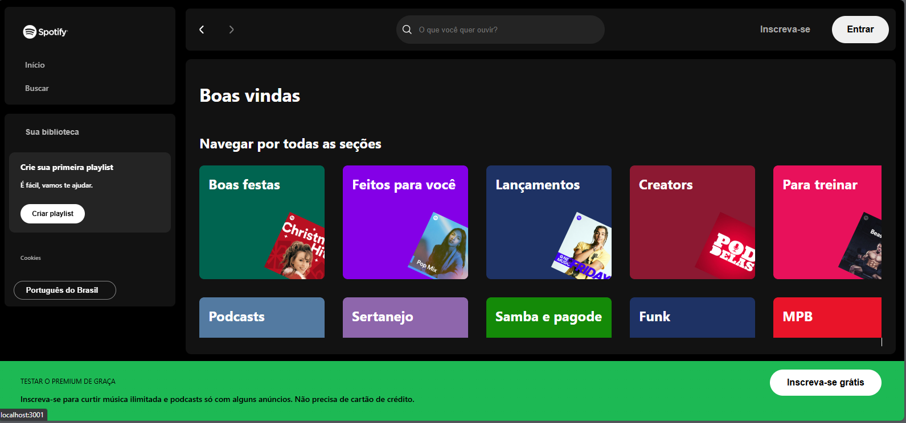

# Spotify Imersão React🎶
O **Spotify Imersão React** é uma aplicação web desenvolvida em React durante a Imersão Alura. 
Permite criar e gerenciar playlists, descobrir novos artistas e acompanhar tendências musicais, 
tudo com uma interface amigável.

## 📋 Funcionalidades
- Criar e Gerenciar Playlists: Adicione e organize suas playlists favoritas.
- Descobrir Novos Artistas: Explore novos artistas e músicas.
- Acompanhar Tendências Musicais: Veja as músicas mais populares do momento.

## 🛠️ Tecnologias Utilizadas
- React
- HTML
- CSS
- JavaScript

## ⚙️ Como Executar o Projeto
### Pré-requisitos
Certifique-se de ter o Visual Studio Code e o Node.js instalados.

### 1. **Passos para executar:**
Clone o repositório:
```bash
git clone https://github.com/pplace11/Spotify-Imersao-React.git
cd Spotify-Imersao-React
```

### 2. **Instale as dependências do Node.js:**
```bash
npm install
```

### Criando um Novo Projeto com Create React App
Para criar um novo projeto React utilizando Create React App, siga os passos abaixo:

### 3. **Certifique-se de ter o Node.js e o Visual Studio Code instalados.**

### 4. **Crie um novo projeto React:**
```bash
npx create-react-app Spotify-Imersao-React
```

### 5. **Navegue até o diretório do projeto:**
```bash
cd Spotify-Imersao-React
```

### 6. **Inicie a aplicação:**
```bash
npm start
```
**A aplicação será aberta em http://localhost:3000.**

##🗂️ Estrutura do Projeto
```plaintext
📁 Spotify-Imersao-React/
├── 📂 node_modules/       # Dependências do Node.js
├── 📂 public/             # Arquivos públicos da aplicação
├── 📂 src/                # Scripts JavaScript e lógica da aplicação
│   ├── 📂 assets/         # Recursos estáticos como CSS, JS e imagens
│   ├── 📂 Footer/         # Componentes e lógica relacionados ao rodapé da aplicação
│   ├── 📂 Header/         # Componentes e lógica relacionados ao cabeçalho da aplicação
│   ├── 📂 Main/           # Componentes e lógica relacionados ao conteúdo principal da aplicação
│   ├── 📂 Sidebar/        # Componentes e lógica relacionados à barra lateral da aplicação
│   ├── 📄 App.css         # Estilos globais da aplicação
│   ├── 📄 App.js          # Componente principal da aplicação
│   ├── 📄 App.test.js     # Testes para o componente principal da aplicação
│   ├── 📄 index.css       # Estilos globais para o ponto de entrada da aplicação
│   ├── 📄 index.js        # Ponto de entrada da aplicação React
├── 📄 package.json        # Configurações do projeto e dependências
├── 📄 package-lock.json   # Versões exatas das dependências instaladas
├── 📄 README.md           # Documentação do projeto
```
## 📸 Preview
Aqui está uma visão geral da interface da aplicação:
